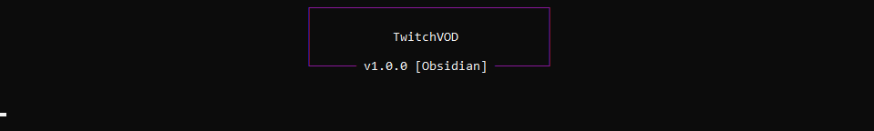

<div>
    <h1 align="center">TVOD<br>Next gen twitch VOD and clip downloader</h1>
</div>

<br>

This project is based on [TwitchNoSub](https://github.com/besuper/TwitchNoSub)
<br>

<h2>Requirements</h2>

- **Python** (up to 3.9)
- **FFMPEG** (can be downloaded [here](https://github.com/BtbN/FFmpeg-Builds/releases))
- **aria2c** (can be downloaded [here](https://github.com/aria2/aria2/releases/tag/release-1.36.0))

<h2>Installation</h2>

```shell
$ pip install -U "git+https://github.com/retouching/tvod.git"
```

<h2>Usage</h2>

<h3>1. CLI mode</h3>

```shell
$ python -m tvod dl [URL] [--proxy URL] [--quality 1080p,720p,480p,360p,160p]
```

Proxy and quality are optionnal (and cli download best quality by default)



<h3>2. Module mode</h3>

Example can be found [here](./tvod/commands/dl.py)

<h2>Warning: Some things need to be considered</h2>

 - This project is not approved by Twitch
